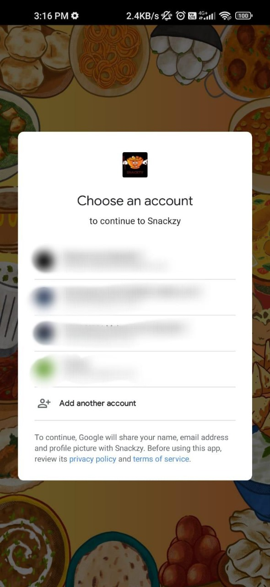

# Snackzy

Snackzy is a food ordering app designed for canteens. It supports real-time ordering and includes features for authentication, payment, and admin management. Admins can add or delete new items from the menu, and users can authenticate and make payments seamlessly.

## Features

- **Real-Time Ordering**: Users can order food from the canteen in real-time.
- **Admin Management**: Admins can add or delete items from the menu.
- **Authentication**: Secure user authentication using Firebase.
- **Payment**: Easy and secure payments using EasyUPIPayment.
- **Firebase Integration**: Authentication and real-time database management using Firebase.

## Screenshots

<table>
  <tr>
    <td></td>
    <td></td>
    <td></td>
  </tr>
  <tr>
    <td></td>
    <td></td>
    <td></td>
  </tr>
  <tr>
    <td></td>
    <td></td>
    <td></td>
  </tr>
  <tr>
    <td></td>
    <td></td>
    <td></td>
  </tr>
</table>

## Installation

Follow these steps to set up the project on your local machine.

### Prerequisites

- Android Studio
- Firebase account
- EasyUPIPayment library

### Setup

1. **Clone the Repository**:

    ```sh
    git clone https://github.com/Zzabi/Snackzy.git
    cd snackzy
    ```

2. **Open in Android Studio**:
    - Open Android Studio.
    - Click on `Open an existing Android Studio project`.
    - Navigate to the `snackzy` directory and open it.

3. **Configure Firebase**:
    - Go to the Firebase Console.
    - Create a new project or use an existing project.
    - Add an Android app to your Firebase project.
    - Register your app with the package name (e.g., `com.example.snackzy`).
    - Download the `google-services.json` file and place it in the `app` directory of your Android project.
    - In the Firebase Console, enable Authentication and Realtime Database.

4. **Add EasyUPIPayment**:
    - Open the `build.gradle` file for your app module.
    - Add the EasyUPIPayment dependency:

        ```groovy
        dependencies {
            implementation 'com.github.mukeshsolanki:easyupipayment:1.0.4'
            // Other dependencies
        }
        ```

    - Sync your project with Gradle files.

## Usage

### User Authentication

- Users can sign up or log in using their email and password.
- Authentication is handled through Firebase.

### Real-Time Ordering

- Users can browse the menu and place orders in real-time.
- Orders are managed through Firebase Realtime Database.

### Admin Management

- Admins can add new items to the menu or delete existing items.
- Admin functionalities are protected and accessible only to authenticated admin users.

### Payments

- Payments are processed using EasyUPIPayment.
- Users can make secure payments directly within the app.

## Acknowledgments

- [Firebase](https://firebase.google.com/) for authentication and real-time database.
- [EasyUPIPayment](https://github.com/mukeshsolanki/easyupipayment) for providing an easy way to integrate UPI payments.


## You can download the [app](main.apk) to try for urself

For trying out admin features<br>
ID = "sanckzy"<br>
Password = "123"

## Leave a Star if this repo is helpful, Thankyou